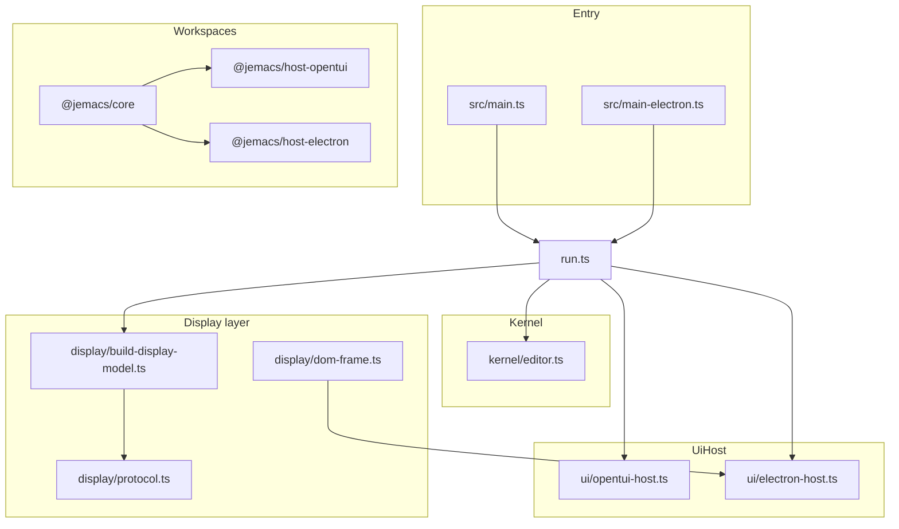

# PLAN.md — Pluggable UI (OpenTUI + Electron)

Jemacs targets **GNU Emacs–style architecture**: a display-agnostic kernel (buffers, windows, keymaps, commands) with **first-class frontends**—terminal via OpenTUI and GUI via Electron—analogous to Emacs `tty` vs `x`/`ns` frames.

Use checkboxes to track work. Implementation landed **2026-06-04** unless noted.

*Last updated: 2026-06-04 (textarea font-lock, dom-frame, workspaces, runtime parity).*

---

## North star

| GNU Emacs | Jemacs (target) |
| --- | --- |
| C core + redisplay | `src/kernel/` — no OpenTUI, no DOM |
| Terminal / GUI frames | **`UiHost`** implementations |
| `read-key` / input | **`NormalizedInput`** → `Editor.handleKey()` |
| Frame redisplay | **`DisplayModel`** consumed by each host |
| Elisp | JavaScript / TypeScript (eval, plugins, modes) |

**Non-goal:** Pixel-perfect GTK Emacs. **Goal:** Same keys, concepts, and extension model.

---

## Current architecture

### Already in place

- [x] **Kernel** — `Editor`, buffers, commands, keymap stack, minibuffer, isearch, registers
- [x] **Window tree** — `windowLayout`; splits update tree
- [x] **Multi-window redisplay** — `OpenTuiHost` syncs `DisplayModel` to OpenTUI panes
- [x] **Input boundary** — `opentui-key.ts` / Electron IPC → `KeyEventLike`
- [x] **Editor events** — `changed`, `message`, `minibuffer` drive `present()`
- [x] **Minor modes**, **hooks**, **LSP**, **themes**, **tests**

### Coupling removed (this effort)

- [x] **Dual entry** — `main.ts` + `createDefaultHost()`; `--gui` / `JEMACS_UI=electron`
- [x] **`display/theme.ts`** — `ThemedText`; no `@opentui/core`
- [x] **Redisplay** — `build-display-model.ts` + `buffer-view.ts` + `viewport.ts`
- [x] **Viewport sizing** — host passes `rows`/`cols`; TUI uses `renderer.on("resize")`
- [x] **`UiHost` interface** — `display/protocol.ts`
- [x] **Electron** — `ElectronHost`, preload, renderer, `bun run dev:gui`

---

## Shared protocol (`src/display/`)

- [x] `protocol.ts` — `DisplayModel`, `UiHost`, `NormalizedInput`, `HostCapabilities`
- [x] `themed-text.ts` — host-agnostic styled chunks
- [x] `theme.ts` — `applyTheme()` → `ThemedText`
- [x] `viewport.ts` — line budgets from host `rows`
- [x] `buffer-view.ts` — `visibleStyledText*` → `ThemedText`
- [x] `build-display-model.ts` — full frame from `Editor`
- [x] `serialize.ts` — JSON-safe model for Electron IPC
- [x] `dom-frame.ts` — shared DOM presenter for Electron (Phase 4b DOM half)
- [x] `run.ts` — `runJemacs(editor, host)`

**`UiHost` checklist:**

- [x] `readonly kind: "tui" | "gui"`
- [x] `start()` / `destroy()`
- [x] `present(model)` / `getViewport()`
- [x] `onInput` / `onResize`
- [x] `capabilities`

**Input:**

- [x] OpenTUI `KeyEvent` / paste → `NormalizedInput`
- [x] Electron DOM `keydown` / paste → `NormalizedInput`
- [x] Mouse click → `NormalizedInput` (`mouse` + `clickWindow`)
- [x] Kernel dispatch unchanged (`handleKey`)

---

## Phase 1 — Display protocol & decouple theme ✅

- [x] `src/display/protocol.ts`
- [x] `src/display/build-display-model.ts`
- [x] `src/display/viewport.ts`
- [x] `ThemedText` + `applyTheme()` without OpenTUI
- [x] `src/ui/opentui-styled.ts` — `ThemedText` → `StyledText`
- [x] `test/build-display-model.test.ts`

---

## Phase 2 — `OpenTuiHost` + `runJemacs` ✅

- [x] `src/ui/opentui-host.ts` — `OpenTuiHost implements UiHost`
- [x] `src/run.ts`
- [x] `src/main.ts` → `runJemacs(editor, createDefaultHost())`
- [x] `src/ui/opentui-key.ts` — OpenTUI-only
- [x] `src/ui/opentui.ts` — re-exports for tests
- [x] `test/opentui-host.test.ts`

---

## Phase 3 — OpenTUI polish (optional)

- [x] Terminal resize → `renderer.on("resize")` → `onResize` → rebuild model
- [x] `TextareaRenderable` for selected window (`JEMACS_USE_TEXTAREA=1`; syncs via `syncText`/`syncPoint`/`syncSpans`)
- [x] Font-lock inside native editor (`opentui-textarea-sync.ts` + `editBuffer` highlights)
- [x] Mouse click → select window / move point (TUI + Electron; `click-to-point.ts`)
- [ ] `@opentui/react` for static chrome only (deferred — imperative chrome is sufficient)

---

## Phase 4 — Electron host ✅ (MVP)

### Package & layout

- [x] `electron` devDependency
- [x] `src/main-electron.ts`
- [x] `src/electron/preload.ts`
- [x] `src/electron/renderer.html` + `renderer.css` + `renderer.ts`
- [x] `scripts/build-electron.ts`
- [x] `bun run dev:gui` / `build:gui`
- [x] README GUI section

### `ElectronHost`

- [x] `class ElectronHost implements UiHost` (`kind: "gui"`)
- [x] Main process: editor + host (via `main-electron.ts` + `runJemacs`)
- [x] `present()` — IPC `jemacs:display` with serialized model
- [x] DOM layout — flex splits, themed spans, modeline
- [x] Editing — read-only display MVP; keys/paste via IPC (not in-buffer DOM edit)
- [x] Keyboard → `NormalizedInput`
- [x] Paste → `insert` + `changed`
- [x] Resize → `getViewport()` from window pixels

### Shared React components (Phase 4b)

- [x] Shared DOM frame module (`display/dom-frame.ts` + Electron renderer)
- [ ] React `JemacsFrame` fed by `DisplayModel` (optional; React not required for GUI MVP)

---

## Phase 5 — Entry points & packaging

- [x] `--gui` and `JEMACS_UI=electron` on `main.ts`
- [x] Separate `main-electron.ts` entry
- [x] `package.json` description + scripts
- [x] Monorepo split (`packages/jemacs-core`, `host-opentui`, `host-electron` workspace packages)
- [x] Tests: display/host/mouse/textarea/bind-jemacs/runtime; `server-path` skips when workspace bin shadows Emacs cache

---

## Testing checklist

- [x] `build-display-model.test.ts`
- [x] `opentui-host.test.ts` (includes `createTestRenderer` frame capture)
- [x] `click-to-point.test.ts`, `mouse-click.test.ts`, `textarea-host.test.ts`, `textarea-highlights.test.ts`, `bind-jemacs.test.ts`
- [x] `smoke-windows.test.ts`, `smoke-commands.test.ts`, `runtime-parity.test.ts`
- [x] Regression: kernel, window, minor-mode, prefix-argument tests pass
- [x] Manual TUI/GUI smoke — covered by automated smoke + host tests; run `bun run dev` / `bun run dev:gui` for human spot-check

---

## Emacs parity backlog

### Core editor

- [x] Buffers — visit, edit, dirty, read-only, basic undo
- [ ] Buffers — multibyte, markers, narrowing, indirect buffers (deferred)
- [x] Buffer-locals — `BufferModel.locals` map
- [x] Windows — tree + split/delete/other-window
- [x] Window-configuration save/restore (see `window.test.ts`)
- [x] scroll-other-window
- [x] Transient mark mode — `transient-mark-mode` custom + toggle command + tests
- [x] Kill ring — partial
- [x] Full prefix argument — `PrefixArgumentState` + `test/prefix-argument.test.ts`

### Input & commands

- [x] Keymap stack, minor modes, minibuffer, completion
- [x] `interactive` specs — `runtime/interactive.ts` + command `interactive` string
- [x] icomplete — incremental `*Completions*` while typing (`refreshMinibufferCompletions`)

### Search, files, help, LSP

- [x] Isearch literal, query-replace, dired partial, help commands, LSP

### Lisp environment

- [x] Evaluator, plugins, hooks
- [x] `defcustom` / `defvar` — `runtime/custom.ts`
- [x] Advice — `runtime/advice.ts` + `invokeWithAdvice` in `Editor.run`
- [x] load-path — `runtime/load-path.ts` + evaluator plugin resolution
- [ ] **python.el** port (deferred — use `python` mode + LSP instead)

---

## Design rules

1. **No `@opentui/*`** outside `src/ui/opentui*` (and `opentui-styled.ts`, `opentui-textarea-sync.ts`).
2. **No buffer logic** in renderables / DOM — view only.
3. **One key model** at host boundary.
4. **Both hosts first-class** — same `runJemacs` + `DisplayModel`.

---

## References

- [OpenTUI docs](https://opentui.com/docs/getting-started)
- Repo: `README.md`, `DEFAULT_KEYBINDINGS.md`, `AGENTS.md`
